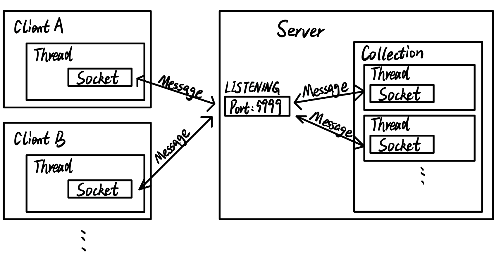

# MyWeChat

MyWeChat，是我初学Java Socket网络编程练手的一个即时通讯系统，该项目使用了Java Socket网络编程、多线程、IO流等知识，主要功能有：

* [x] 拉取在线用户列表

* [x] 私聊

* [x] 群发

* [x] 发文件

* [x] 服务器推送新闻

* [x] 离线留言

* [x] 离线发送文件

* [x] 无异常退出系统

MyWeChat的架构如下图所示：

MyWeChat，未来考虑加入数据库模块和注册中心。

